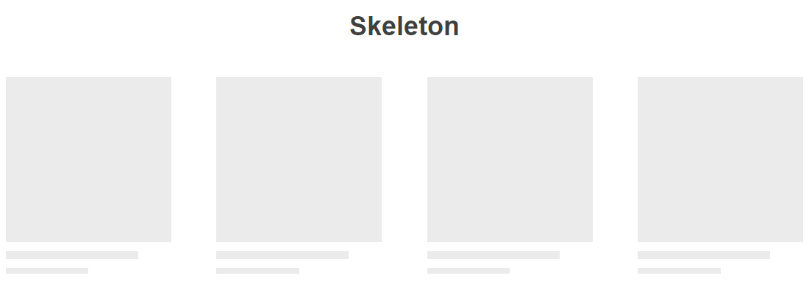

# Skeleton Component Custom

Componente criado para encapsular blocos nativos da VTEX IO, exibindo um loading personalizado até que o `children` (_bloco nativo informado_) seja detectado no viewport para exibir no lugar do loading.



## Descrição:
Nesse exemplo eu encapsulei os `children's` do `product-summary.shelf` no componente custom `skeleton`.

```json
"product-summary.shelf": {
    "children": [ "skeleton" ]
},
"skeleton": {
    "children": [ 
      "product-summary-image",
      "product-summary-brand",
      "product-summary-name",
      "product-list-price",
      "product-selling-price",
      "product-summary-space",
      "add-to-cart-button#shelf"
    ]
}
```
Fiz a chamada do componente no arquivo `interfaces.json`:
```json
"skeleton": {
  "component": "Skeleton",
  "composition": "children"
}
```
## Component Skeleton
```js
// index
import React, { useState, useRef } from 'react';
import SkeletonElement from './SkeletonElement';
import { useOnView } from 'vtex.on-view'

const Skeleton = ({ children }) => {
  const [ loading, setLoading ] = useState(true)
  const element = useRef(null)

  useOnView({
    ref: element,
    once: true,
    onView: () => {
      setLoading(false)
    },
  })

  return loading ? (
    <div ref={ element }>
      <SkeletonElement type="item" width="300px" height="auto">
        <SkeletonElement type="image" width="100%" height="300px"/>
        <SkeletonElement type="text" width="80%" height="15px"/>
        <SkeletonElement type="text" width="50%" height="10px"/>
      </SkeletonElement>
    </div>
  ) : <div ref={ element }>{ children }</div>

};

export default Skeleton;
```

## Validação
Como validação, utilizei o `hook` da VTEX IO, [useOnView](https://github.com/vtex-apps/on-view) para verificar se o elemento já esta visível e o `hook` do React `useState` para criar um estado boleano, modificando esse estado após a verificação do `onView`. 
```text
💡 Utilizando o useOnView é possível informar uma referência com o useRef() e aplicar uma ação quando essa referência estiver visível no viewport.
```

Utilizei o `useRef` para referenciar no `return` os blocos que desejo exibir (`skeleton` e `children`), e para alternar entre eles, criei um estado de `loading` com valor inicial `true` e dentro do `hook` `useOnView` eu mudo o valor do estado `loading` para `false` quando existir o retorno no viewport da referência criada.

## Component SkeletonElement

Para a estrutura do `loading skeleton` eu criei um componente onde a modificação individual ocorre quando são passadas, via `props`, as propriedades de referência de cada tipo (`item`, `image` e `text`), que poderão ser modificadas conforme a necessidade de utilização em seu projeto.
```js
// SkeletonElement
import React from 'react';
import './SkeletonElement.global.css'

const SkeletonElement = ({ type, width, height, children }) => {
  const classes = `skeleton ${ type }`
  const mystyle = {
    width: width,
    height: height
  };

  return (
    <div className={classes} style={mystyle}>{ children }</div>
  );
};

export default SkeletonElement;
```
Assim, quando chamar esse componente é necessário informar o tipo e suas dimensões. 
Ex.: 
```jsx 
<SkeletonElement type="image" width="100%" height="400px"/>
```
## Informações adicionais:

Para utilizar `hook useOnView` da VTEX IO é necessário instalar a dependência:
```bash
vtex install vtex.on-view@1.x
```
E adicionar a linha no `manifest.json`
```json
"vtex.on-view": "1.x"
```
